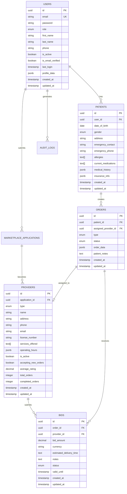

# Database Schema Documentation

## Overview

The AI-Powered Care backend uses PostgreSQL as the primary database with a comprehensive schema designed for healthcare marketplace operations, patient management, and AI-powered features.

## Entity Relationship Diagram



## Table Definitions

### Users Table

Primary table for all system users across different roles.

```sql
CREATE TABLE users (
    id UUID PRIMARY KEY DEFAULT uuid_generate_v4(),
    email VARCHAR(255) UNIQUE NOT NULL,
    password VARCHAR(255) NOT NULL,
    role user_role NOT NULL DEFAULT 'patient',
    first_name VARCHAR(255),
    last_name VARCHAR(255),
    phone VARCHAR(20),
    is_active BOOLEAN DEFAULT true,
    is_email_verified BOOLEAN DEFAULT false,
    last_login TIMESTAMP,
    profile_data JSONB,
    created_at TIMESTAMP DEFAULT CURRENT_TIMESTAMP,
    updated_at TIMESTAMP DEFAULT CURRENT_TIMESTAMP
);

-- Indexes
CREATE INDEX idx_users_email ON users(email);
CREATE INDEX idx_users_role ON users(role);
CREATE INDEX idx_users_active ON users(is_active) WHERE is_active = true;
```

**Enums:**
```sql
CREATE TYPE user_role AS ENUM (
    'patient',
    'doctor', 
    'pharmacy_staff',
    'lab_staff',
    'admin'
);
```

**Constraints:**
- Email must be unique and valid format
- Password minimum 8 characters (enforced at application level)
- Role must be one of the defined enum values

### Patients Table

Extended profile information for patient users.

```sql
CREATE TABLE patients (
    id UUID PRIMARY KEY DEFAULT uuid_generate_v4(),
    user_id UUID UNIQUE NOT NULL REFERENCES users(id) ON DELETE CASCADE,
    date_of_birth DATE,
    gender gender_type,
    address TEXT,
    emergency_contact VARCHAR(255),
    emergency_phone VARCHAR(20),
    allergies TEXT[],
    current_medications TEXT[],
    medical_history JSONB,
    insurance_info JSONB,
    created_at TIMESTAMP DEFAULT CURRENT_TIMESTAMP,
    updated_at TIMESTAMP DEFAULT CURRENT_TIMESTAMP
);

-- Indexes
CREATE INDEX idx_patients_user_id ON patients(user_id);
CREATE INDEX idx_patients_dob ON patients(date_of_birth);
```

**Enums:**
```sql
CREATE TYPE gender_type AS ENUM (
    'male',
    'female', 
    'other',
    'prefer_not_to_say'
);
```

**JSONB Structure Examples:**

*medical_history:*
```json
{
    "conditions": ["Hypertension", "Type 2 Diabetes"],
    "surgeries": [
        {
            "procedure": "Appendectomy",
            "date": "2010-05-15",
            "hospital": "Boston Medical Center"
        }
    ],
    "family_history": [
        {
            "relation": "Father",
            "condition": "Heart Disease",
            "age_of_onset": 55
        }
    ]
}
```

*insurance_info:*
```json
{
    "primary": {
        "provider": "Blue Cross Blue Shield",
        "policy_number": "BC123456789",
        "group_number": "GRP001",
        "effective_date": "2024-01-01"
    },
    "secondary": null
}
```

### Marketplace Applications Table

Applications from healthcare providers to join the marketplace.

```sql
CREATE TABLE marketplace_applications (
    id UUID PRIMARY KEY DEFAULT uuid_generate_v4(),
    applicant_user_id UUID NOT NULL REFERENCES users(id),
    business_type business_type NOT NULL,
    business_name VARCHAR(255) NOT NULL,
    address TEXT NOT NULL,
    contact_email VARCHAR(255) NOT NULL,
    contact_phone VARCHAR(20) NOT NULL,
    website VARCHAR(255),
    license_number VARCHAR(100) NOT NULL,
    business_details JSONB NOT NULL,
    regulatory_compliance_notes TEXT,
    attested_compliance BOOLEAN DEFAULT false,
    status application_status DEFAULT 'submitted',
    reviewed_by UUID REFERENCES users(id),
    review_notes TEXT,
    submitted_at TIMESTAMP DEFAULT CURRENT_TIMESTAMP,
    reviewed_at TIMESTAMP,
    created_at TIMESTAMP DEFAULT CURRENT_TIMESTAMP,
    updated_at TIMESTAMP DEFAULT CURRENT_TIMESTAMP
);
```

**Enums:**
```sql
CREATE TYPE business_type AS ENUM ('clinic', 'pharmacy', 'lab');
CREATE TYPE application_status AS ENUM (
    'submitted',
    'under_review',
    'approved', 
    'rejected'
);
```

### Providers Table

Approved healthcare providers in the marketplace.

```sql
CREATE TABLE providers (
    id UUID PRIMARY KEY DEFAULT uuid_generate_v4(),
    application_id UUID UNIQUE NOT NULL REFERENCES marketplace_applications(id),
    type provider_type NOT NULL,
    name VARCHAR(255) NOT NULL,
    address TEXT NOT NULL,
    phone VARCHAR(20) NOT NULL,
    email VARCHAR(255) NOT NULL,
    website VARCHAR(255),
    license_number VARCHAR(100) NOT NULL,
    services_offered TEXT[] NOT NULL,
    certifications TEXT[],
    operating_hours JSONB,
    service_region VARCHAR(255),
    is_active BOOLEAN DEFAULT true,
    accepting_new_orders BOOLEAN DEFAULT true,
    average_rating DECIMAL(3,2) DEFAULT 0.00,
    total_orders INTEGER DEFAULT 0,
    completed_orders INTEGER DEFAULT 0,
    provider_specific_data JSONB,
    created_at TIMESTAMP DEFAULT CURRENT_TIMESTAMP,
    updated_at TIMESTAMP DEFAULT CURRENT_TIMESTAMP
);

-- Indexes
CREATE INDEX idx_providers_type ON providers(type);
CREATE INDEX idx_providers_active ON providers(is_active) WHERE is_active = true;
CREATE INDEX idx_providers_accepting ON providers(accepting_new_orders) WHERE accepting_new_orders = true;
CREATE INDEX idx_providers_rating ON providers(average_rating);
CREATE INDEX idx_providers_location ON providers USING gin(to_tsvector('english', address));
```

**Enums:**
```sql
CREATE TYPE provider_type AS ENUM ('pharmacy', 'lab');
```

**JSONB Structure Examples:**

*operating_hours:*
```json
{
    "monday": "08:00-20:00",
    "tuesday": "08:00-20:00", 
    "wednesday": "08:00-20:00",
    "thursday": "08:00-20:00",
    "friday": "08:00-20:00",
    "saturday": "09:00-18:00",
    "sunday": "10:00-16:00"
}
```

*provider_specific_data (Pharmacy):*
```json
{
    "offers_delivery": true,
    "delivery_radius_km": 15,
    "compounding_services": true,
    "specialty_medications": ["oncology", "fertility"],
    "insurance_accepted": ["BCBS", "Aetna", "Cigna"]
}
```

*provider_specific_data (Lab):*
```json
{
    "tests_offered": ["CBC", "CMP", "Lipid Panel", "HbA1c"],
    "avg_turnaround_hours": 24,
    "stat_testing_available": true,
    "certifications": ["CLIA", "CAP"],
    "max_daily_capacity": 500
}
```

### Orders Table

Healthcare service orders from patients.

```sql
CREATE TABLE orders (
    id UUID PRIMARY KEY DEFAULT uuid_generate_v4(),
    patient_id UUID NOT NULL REFERENCES patients(id),
    assigned_provider_id UUID REFERENCES providers(id),
    type order_type NOT NULL,
    status order_status DEFAULT 'pending_broadcast',
    order_data JSONB NOT NULL,
    patient_notes TEXT,
    urgency urgency_level DEFAULT 'standard',
    estimated_completion TIMESTAMP,
    actual_completion TIMESTAMP,
    total_amount DECIMAL(10,2),
    currency VARCHAR(3) DEFAULT 'USD',
    created_at TIMESTAMP DEFAULT CURRENT_TIMESTAMP,
    updated_at TIMESTAMP DEFAULT CURRENT_TIMESTAMP
);

-- Indexes
CREATE INDEX idx_orders_patient_id ON orders(patient_id);
CREATE INDEX idx_orders_provider_id ON orders(assigned_provider_id);
CREATE INDEX idx_orders_status ON orders(status);
CREATE INDEX idx_orders_type ON orders(type);
CREATE INDEX idx_orders_created_at ON orders(created_at);
```

**Enums:**
```sql
CREATE TYPE order_type AS ENUM ('pharmacy', 'lab');
CREATE TYPE order_status AS ENUM (
    'pending_broadcast',
    'awaiting_bids',
    'bids_received',
    'assigned',
    'in_progress',
    'out_for_delivery',
    'ready_for_pickup',
    'completed',
    'cancelled'
);
CREATE TYPE urgency_level AS ENUM ('low', 'standard', 'urgent', 'stat');
```

### Bids Table

Provider bids on healthcare service orders.

```sql
CREATE TABLE bids (
    id UUID PRIMARY KEY DEFAULT uuid_generate_v4(),
    order_id UUID NOT NULL REFERENCES orders(id) ON DELETE CASCADE,
    provider_id UUID NOT NULL REFERENCES providers(id),
    bid_amount DECIMAL(10,2) NOT NULL,
    currency VARCHAR(3) DEFAULT 'USD',
    estimated_delivery_time VARCHAR(100),
    estimated_turnaround_time VARCHAR(100),
    notes TEXT,
    status bid_status DEFAULT 'submitted',
    valid_until TIMESTAMP,
    score DECIMAL(5,3),
    created_at TIMESTAMP DEFAULT CURRENT_TIMESTAMP,
    updated_at TIMESTAMP DEFAULT CURRENT_TIMESTAMP,
    
    UNIQUE(order_id, provider_id)
);

-- Indexes
CREATE INDEX idx_bids_order_id ON bids(order_id);
CREATE INDEX idx_bids_provider_id ON bids(provider_id);
CREATE INDEX idx_bids_status ON bids(status);
CREATE INDEX idx_bids_score ON bids(score DESC);
```

**Enums:**
```sql
CREATE TYPE bid_status AS ENUM (
    'submitted',
    'accepted',
    'rejected', 
    'expired'
);
```

### Algorithm Configuration Table

Configurable weights for provider matching algorithms.

```sql
CREATE TABLE algorithm_configurations (
    id UUID PRIMARY KEY DEFAULT uuid_generate_v4(),
    name VARCHAR(255) NOT NULL,
    description TEXT,
    service_type provider_type NOT NULL,
    price_weight DECIMAL(3,2) NOT NULL CHECK (price_weight >= 0 AND price_weight <= 1),
    speed_weight DECIMAL(3,2) NOT NULL CHECK (speed_weight >= 0 AND speed_weight <= 1),
    quality_weight DECIMAL(3,2) NOT NULL CHECK (quality_weight >= 0 AND quality_weight <= 1),
    max_bid_wait_time_minutes INTEGER DEFAULT 30,
    min_bids_required INTEGER DEFAULT 1,
    max_bids_considered INTEGER DEFAULT 10,
    is_active BOOLEAN DEFAULT true,
    created_by UUID NOT NULL REFERENCES users(id),
    created_at TIMESTAMP DEFAULT CURRENT_TIMESTAMP,
    updated_at TIMESTAMP DEFAULT CURRENT_TIMESTAMP,
    
    CONSTRAINT weights_sum_check CHECK (
        ABS((price_weight + speed_weight + quality_weight) - 1.0) < 0.001
    )
);
```

### Audit Logs Table

Comprehensive audit trail for all system activities.

```sql
CREATE TABLE audit_logs (
    id UUID PRIMARY KEY DEFAULT uuid_generate_v4(),
    user_id UUID REFERENCES users(id),
    action VARCHAR(100) NOT NULL,
    resource_type VARCHAR(100) NOT NULL,
    resource_id UUID,
    old_values JSONB,
    new_values JSONB,
    ip_address INET,
    user_agent TEXT,
    session_id VARCHAR(255),
    created_at TIMESTAMP DEFAULT CURRENT_TIMESTAMP
);

-- Indexes
CREATE INDEX idx_audit_logs_user_id ON audit_logs(user_id);
CREATE INDEX idx_audit_logs_action ON audit_logs(action);
CREATE INDEX idx_audit_logs_resource ON audit_logs(resource_type, resource_id);
CREATE INDEX idx_audit_logs_created_at ON audit_logs(created_at);
```

## Data Relationships

### One-to-One Relationships
- `users` ↔ `patients`: Each patient user has one patient profile
- `marketplace_applications` ↔ `providers`: Each approved application becomes one provider

### One-to-Many Relationships
- `users` → `marketplace_applications`: Users can submit multiple applications
- `patients` → `orders`: Patients can create multiple orders
- `providers` → `bids`: Providers can submit multiple bids
- `orders` → `bids`: Orders can receive multiple bids
- `users` → `audit_logs`: Users generate multiple audit log entries

### Many-to-One Relationships
- `orders` → `providers`: Orders are assigned to one provider
- `bids` → `orders`: Bids are for one specific order
- `bids` → `providers`: Bids are submitted by one provider

## Performance Considerations

### Indexing Strategy
- Primary keys (UUID) are automatically indexed
- Foreign keys are indexed for join performance
- Frequently queried columns have dedicated indexes
- Composite indexes for common query patterns
- Partial indexes for filtered queries (e.g., active records only)

### Query Optimization
- Use of JSONB for flexible schema with GIN indexes
- Proper use of LIMIT and OFFSET for pagination
- Efficient joins using foreign key relationships
- Materialized views for complex reporting queries

### Scaling Considerations
- Read replicas for read-heavy workloads
- Partitioning for large tables (audit_logs, orders)
- Connection pooling for database connections
- Caching layer (Redis) for frequently accessed data
